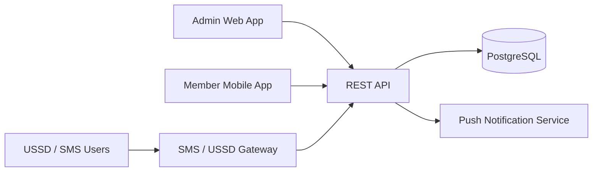

# ParishConnect Architecture

## System Context

## Backend Modules

| Module | Responsibility |
| --- | --- |
| Identity | Login, roles, permissions, sessions, password reset. |
| People | Members, visitors, households, branches, ministries. |
| Attendance | Services, events, QR check-in, manual attendance, corrections. |
| Messaging | Announcements, SMS, push notifications, delivery logs. |
| Stewardship | Tithe and offering records, contribution history, financial reports. |
| Reporting | Aggregated dashboards, exports, scheduled summaries. |
| Import | CSV/Excel templates, validation, migration logs. |
| Audit | Sensitive action history and compliance trail. |

## Deployment View

- API service runs behind HTTPS.
- PostgreSQL stores operational data.
- Object storage may be added later for document uploads and generated exports.
- Background worker processes imports, notification sends, and scheduled reminders.
- SMS/USSD providers are integrated behind provider-neutral adapters.

## Data Protection

- Separate tenant or branch boundaries must be enforced at query level.
- Financial records require stricter permissions than ordinary profile records.
- Audit log entries should be append-only.
- Exports should be permission-gated and logged.

